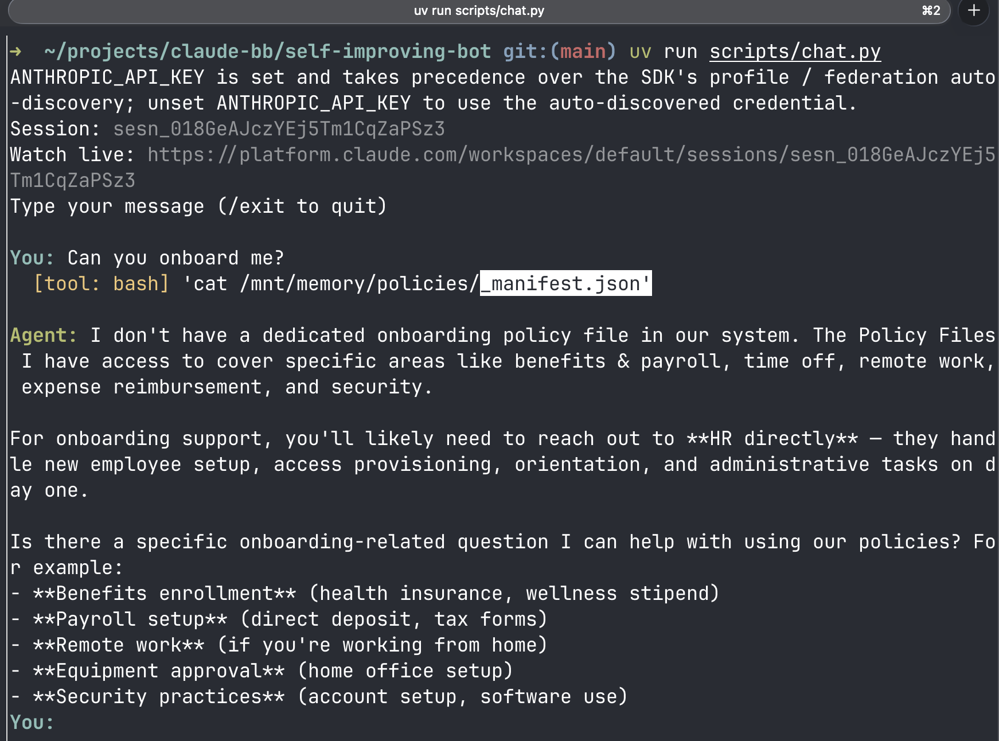
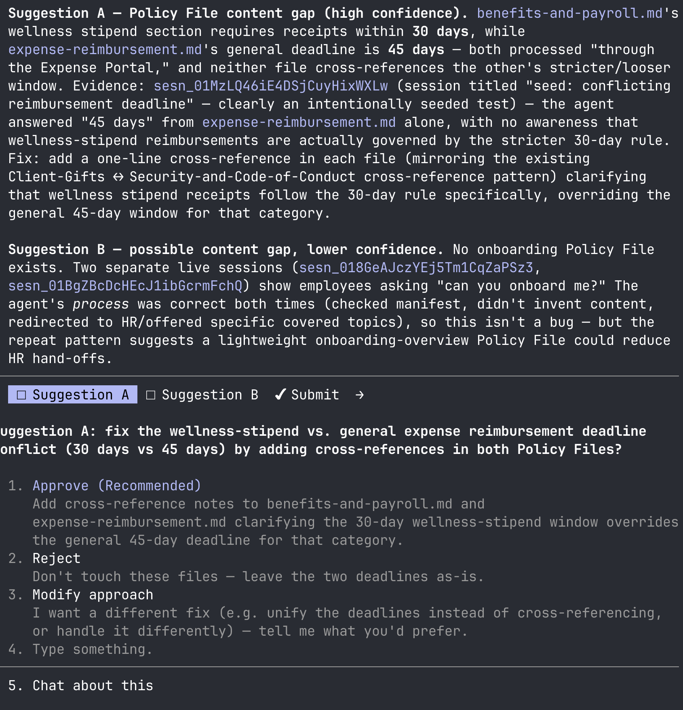
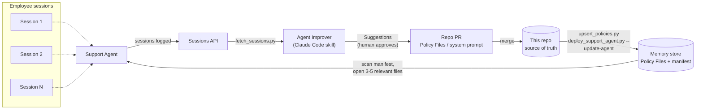

# Self-Improving Support Bot

A Support Agent (Anthropic Managed Agents) that answers employee queries
from a memory store of Policy Files, plus an `agent-improver` Claude Code
skill that reviews past sessions and proposes Policy File or system-prompt
fixes for human approval.

## Business value

Internal support (HR, IT, benefits, expense policy, etc.) is usually
answered one of two ways, and both are expensive: a human answers every
ticket, or an LLM gets every policy stuffed into its system prompt so it
never has to ask. This project targets the second failure mode:

- **Cheaper at scale.** The Support Agent doesn't hold every policy in
  context. It scans lightweight frontmatter (title/topics/summary) for all
  Policy Files in one read, opens only the 3–5 files that are actually
  relevant to a given question (the **Relevance Cap**), and asks a
  clarifying question rather than reading more. Context cost stays flat as
  the policy library grows.
- **Less drift, one source of truth.** Policy Files live in this repo, not
  scattered across chat history or copy-pasted into a prompt. The Upsert
  Script is the only path that writes to the memory store, so there's never
  a question of which copy is current (see
  [ADR-0003](./docs/adr/0003-repo-is-source-of-truth.md)).
- **Gets better from its own usage, safely.** Instead of manually
  auditing transcripts to find where the bot gave a bad or incomplete
  answer, the Agent Improver skill reads every past session, judges
  whether the root cause was a content gap (fix the Policy File) or a
  behavior gap (fix the system prompt), and turns matching sessions into
  reviewable Suggestions.
- **A human stays the approver, not the bot.** The Agent Improver never
  edits anything directly — it proposes, a human approves each Suggestion
  individually, and the change lands as a normal, diffable, revertible PR.
  This keeps the self-improvement loop auditable instead of an opaque
  agent silently rewriting its own instructions.

## Examples

Chatting with the deployed Support Agent (`uv run scripts/chat.py`). It
checks the manifest, finds no onboarding Policy File, and redirects to HR
instead of inventing an answer:

The `agent-improver` skill surfacing a Suggestion from past sessions — here,
a Policy File content gap where the wellness-stipend receipt deadline (30
days) conflicts with the general expense reimbursement deadline (45 days) —
awaiting human approval before any file is edited:

## Architecture

Two Managed Agents deployments share one memory store of Policy Files:

- **Support Agent** — answers employee queries via progressive disclosure:
  read the Manifest first, judge relevance from frontmatter alone, open
  only the files that clear the bar, stop and ask a clarifying question
  once the Relevance Cap is hit instead of reading further.
- **Memory store** — Policy Files (markdown with `title`/`topics`/`summary`
  frontmatter) plus `_manifest.json`, mounted as a real directory in the
  agent's sandbox so frontmatter-only reads are cheap Bash calls, not full
  `Memory.retrieve` calls (see
  [ADR-0001](./docs/adr/0001-frontmatter-exploration-via-bash.md)).
  Written only by the Upsert Script, never by an agent directly.
- **Agent Improver** — a local Claude Code skill, not a third deployment.
  On demand, it lists and retrieves every past Support Agent session,
  judges per-session root cause, aggregates matching sessions into
  Suggestions, and pauses for human approval before editing any file (see
  [ADR-0004](./docs/adr/0004-agent-improver-is-a-local-skill.md)).
- **Repo → memory store, one direction.** The repo is authoritative; the
  Upsert Script pushes Policy File changes and regenerates the Manifest
  (there's no platform-native trigger to do this automatically, see
  [ADR-0002](./docs/adr/0002-no-native-manifest-regen-trigger.md)); an
  Agent Improver-approved system-prompt change is published as a new Agent
  version via `deploy_support_agent.py --update-agent`.

See `architecture.drawio` for the full diagram, including the earlier
design iterations it evolved from and the flaws each iteration fixed.

See `CLAUDE.md` for setup and `CONTEXT.md` for domain language and platform
facts.
